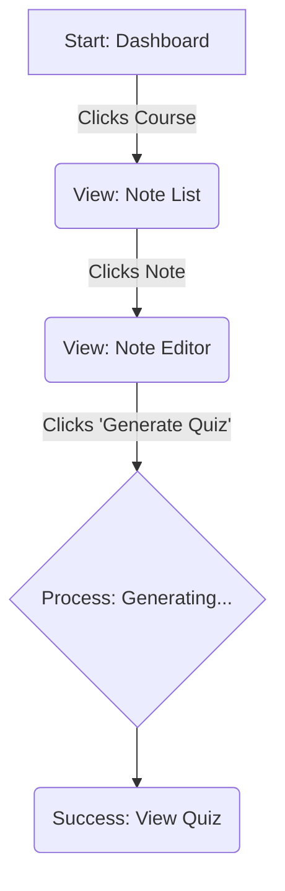

# AI Study Buddy UX Design Specification

_Created on 22. november 2025 by BIP_
_Generated using BMad Method - Create UX Design Workflow v1.0_

---

## Executive Summary

**Project Vision:** To create a minimalist, AI-powered web application that helps students feel productive, calm, and focused. It achieves this by providing a distraction-free environment where they can turn their study notes into quizzes, improving their learning efficiency.

**Core Experience:** The application's success hinges on the core user journey of creating a note and generating a quiz. The 'Generate Quiz' action is the most critical and must be a fast, simple, and seamless experience on both desktop and mobile platforms.

**Guiding Principles:**
- **Desired Emotional Response:** The user should feel productive, calm, and focused.
- **Inspiration:** The design will be guided by the principle of being "intuitive and minimal," prioritizing clarity and ease of use.

---

## 1. Design System Foundation

The decision was made to use a **Component-Led Design Strategy** rather than adopting a pre-existing component library. This involves creating a minimal, bespoke set of components designed specifically for the application's core user flow, ensuring a distraction-free and highly focused user experience. The component definitions are outlined in Section 6.

---

## 2. Core User Experience

### 2.1 Novel UX Patterns

#### Seamless AI Quiz Generation
The primary novel user experience pattern is the **Seamless AI Quiz Generation**. This pattern is defined by its intentional simplicity from the user's perspective.

- **The Problem:** Traditional AI tools often expose complex settings and require multiple steps (e.g., selecting models, adjusting parameters, waiting for foreground processing). This can be intimidating and distracting, contradicting our goal of a calm and focused environment.
- **Our Solution:** We abstract this complexity entirely. The user's only task is to write their notes and click a single, prominent "Generate Quiz" button.
- **The Experience:**
    1.  **Single Click:** The user initiates the entire complex process with one action.
    2.  **Asynchronous Processing:** The AI generation happens entirely in the background. The user is not blocked and is shown a clear, unobtrusive loading state.
    3.  **Magical Result:** The quiz appears in place once ready. The experience is designed to feel fast and almost magical, as if the app anticipated the user's need and delivered the result with minimal effort.

This pattern is "novel" in its deliberate rejection of user-facing complexity, making the powerful AI feel like a natural and effortless extension of the note-taking process.

---

## 3. Visual Foundation

### 3.1 Color System: Deep Focus Blue
The "Deep Focus Blue" theme was chosen for its calming and professional feel. It uses a muted blue as the primary color to promote focus, paired with a clean grayscale for text and backgrounds. The theme includes both light and dark modes.
- **Interactive Demo:** A full demonstration of this color palette is available in `docs/ux-color-themes.html`.

### 3.2 Typography: System Fonts
To ensure a minimal, fast, and platform-familiar experience, the application will use a system-native sans-serif font stack. This means the app will use the default font of the user's operating system (e.g., Segoe UI on Windows, San Francisco on macOS).

### 3.3 Spacing: 8-Point Grid
All layout and spacing will adhere to an 8-point grid system. Using multiples of 8px for margins, padding, and component sizes will create a visually consistent, harmonious, and professional layout.

---

## 4. Design Direction

### 4.1 Chosen Design Approach: The Power Dashboard

The "Power Dashboard" direction was selected.

- **Design Philosophy:** This direction is designed to feel like a powerful and efficient productivity tool. It uses a persistent sidebar for global navigation, giving the user quick and easy access to all sections of the application, such as the Dashboard, Note Editor, and Quiz List.
- **Layout:** It employs a multi-column layout (sidebar + main content area), which is ideal for desktop use and can be gracefully adapted to mobile by collapsing the sidebar behind a menu icon.
- **Rationale:** This choice prioritizes efficiency and user control, aligning with the "productive" aspect of our desired emotional response. It makes it easy for users to navigate between different contexts without losing their place.
- **Interactive Demo:** A mockup of this direction is available in `docs/ux-design-directions.html`.

---

## 5. User Journey Flows

### 5.1 Core Quiz Generation Flow
- **User Goal:** To seamlessly create a quiz from a specific lecture note.
- **Approach:** This journey takes place entirely within the main `AppLayout`. The sidebar remains persistent for navigation, while the main content area dynamically updates as the user moves through the flow.

**Flow Steps:**

1.  **Start at Dashboard:** The user logs in and sees their `CourseCard`s in the main content area.
2.  **Select a Course:** The user clicks on a `CourseCard`. The main content area transitions to display the `NoteList` for the selected course.
3.  **Select a Note:** The user clicks on a `NoteListItem` (or a "Create New Note" button). The main content area transitions to the `NoteEditor`, displaying the note's content.
4.  **Generate Quiz:** After adding or editing content, the user clicks the prominent `GenerateQuizButton`.
5.  **Loading State:** A `QuizLoadingState` indicator appears in the main content area, providing clear feedback that the AI is working.
6.  **View Quiz:** Upon completion, the `QuizLoadingState` is replaced by the `QuizView`, displaying the newly generated quiz. The user can now study, copy, or delete the quiz.

**Visual Flowchart:**

---

## 6. Component Library

### 6.1 Component Strategy
This section outlines the minimal, bespoke components designed for the application.

#### 6.1.1 Authentication Components
- **Component Breakdown:** `AuthPage`, `AuthForm`, `EmailInput`, `PasswordInput`, `SubmitButton`, `ToggleAuthModeLink`.
- **Purpose:** To provide a secure and completely frictionless entry point to the application.
- **Interaction Notes:** The form will use a single, clean layout for both login and sign-up, toggled by a simple link. The submit button will have a clear loading state.
- **Accessibility:** All inputs will have associated labels. Errors will be announced by screen readers via `aria-live` regions.

#### 6.1.2 Dashboard & Course Components
- **Component Breakdown:** `AppLayout` (minimal header), `CourseList` (grid or list), `CourseCard`, `CreateCourseButton`.
- **Purpose:** To provide a calm, organized overview of the user's courses.
- **Interaction Notes:** `CourseCard`s will have a subtle hover effect and navigate to the course's note list on click.
- **Accessibility:** The course list will be navigable via keyboard, and cards will have a clear focus state.

#### 6.1.3 Note Components
- **Component Breakdown:** `NoteList`, `NoteListItem`, `NoteEditor` (distraction-free layout), `TitleInput`, `ContentTextarea`, `GenerateQuizButton`.
- **Purpose:** To enable effortless content creation and provide a seamless transition to the app's core "Generate Quiz" action.
- **Interaction Notes:** The editor will auto-save. The `GenerateQuizButton` is the page's primary action and will be visually prominent.
- **Accessibility:** The text area will be fully accessible, and auto-save status changes will be announced politely.

#### 6.1.4 Quiz Components
- **Component Breakdown:** `QuizLoadingState` (unobtrusive indicator), `QuizView` (read-only display), `Question`, `QuizActionToolbar`, `QuizList`, `QuizListItem`.
- **Purpose:** To present generated quizzes in a clear, readable format and manage previously generated content.
- **Interaction Notes:** The loading state is replaced by the quiz view upon completion. Deleting a quiz will require confirmation.
- **Accessibility:** Quizzes will be structured with proper headings and lists. Loading and confirmation states will be clearly announced to screen readers.

---

## 7. UX Pattern Decisions

To ensure a cohesive and predictable user experience, the following interaction patterns will be applied consistently across the application.

### 7.1 Button Hierarchy
A clear visual hierarchy will be used to signify the importance of actions.
- **Primary Button:** Solid blue. Reserved for the main positive action on a page (e.g., "Generate Quiz").
- **Secondary Button:** Dark gray. For secondary actions that are less critical (e.g., "Add Note").
- **Destructive Button:** Solid red. Used exclusively for destructive actions (e.g., "Delete") within confirmation modals.

### 7.2 Feedback Patterns
The application will provide clear feedback for system states.
- **Loading:** For major actions, an inline loading message will occupy the main content area. For minor actions, the button that was clicked will show a spinner.
- **Success:** A non-intrusive "toast" notification will appear at the bottom of the screen and auto-dismiss (e.g., "Note saved!").
- **Error:** For form validation, errors will appear as inline text below the relevant field. For all other errors, a toast notification will be used.

### 7.3 Form Patterns
All forms will follow a consistent and simple structure.
- **Labels:** Will be placed directly above their corresponding input field.
- **Validation:** Errors will only be displayed after a user has finished interacting with a field (`onBlur`) to prevent distraction while typing. Required fields are marked with an asterisk (*).

### 7.4 Modal (Confirmation) Patterns
Modals will be used sparingly to avoid interrupting the user.
- **Usage:** Only for critical, destructive actions (e.g., confirming deletion).
- **Behavior:** A simple, centered dialog will appear, containing a clear question and explicit "Confirm" (destructive) and "Cancel" buttons. The modal can also be dismissed by pressing the Escape key or clicking outside the dialog.

### 7.5 Empty State Patterns
Lists that contain no items will be designed to guide the user.
- **Appearance:** A helpful, centered message will be displayed (e.g., "You have no courses yet"), accompanied by a primary action button to encourage the user's next step (e.g., "Create Your First Course").

---

## 8. Responsive Design & Accessibility

### 8.1 Responsive Strategy
The "Power Dashboard" layout will adapt to different screen sizes to ensure an optimal experience on all devices.
- **Desktop (Large Screens):** The standard two-column layout will be used, with the sidebar always visible.
- **Tablet (Medium Screens):** The sidebar will collapse to show only icons, saving horizontal space while keeping navigation accessible. Tapping an icon will expand the full sidebar.
- **Mobile (Small Screens):** The sidebar will be hidden off-screen and can be revealed by tapping a menu icon in the header. This allows the main content to use the full width of the screen.

### 8.2 Accessibility Strategy
The application will adhere to **WCAG 2.1 Level AA** standards to be usable by everyone.
- **Target:** WCAG 2.1 Level AA.
- **Color Contrast:** All text and UI elements will be verified to meet or exceed AA contrast ratio requirements.
- **Keyboard Navigation:** All interactive elements will be fully navigable and operable using only a keyboard, with a logical and predictable focus order.
- **Visible Focus States:** A clear and highly visible focus ring will be present on any element that currently has keyboard focus.
- **Screen Reader Support:** Proper HTML semantics and ARIA attributes will be used to ensure the application is clearly understood and navigable by screen readers.
- **Forms:** All form inputs will have correctly associated labels for clarity and accessibility.

---

## 9. Implementation Guidance

### 9.1 Completion Summary
This document outlines the complete User Experience design for the AI Study Buddy application, achieved through a collaborative process. All design decisions were made to support the core goals of a focused, minimal, and productive user experience.

**Key Decisions Made:**
- **Design Strategy:** A **Component-Led** approach was chosen, focusing on a minimal set of bespoke components.
- **Visual Foundation:** The **"Deep Focus Blue"** theme was selected, paired with system-native fonts and an 8-point grid system.
- **Design Direction:** The **"Power Dashboard"** layout was chosen for its efficiency and clear navigational structure.
- **User Journeys:** The core user flow of quiz generation was mapped and documented.
- **UX Patterns:** A comprehensive set of consistency rules for feedback, forms, and confirmations was established.
- **Responsive & Accessibility:** A clear strategy was defined to ensure the application works across all devices and meets **WCAG 2.1 Level AA** standards.

**Final Deliverables:**
- `docs/ux-design-specification.md` (This document)
- `docs/ux-color-themes.html` (Interactive Color Theme Visualizer)
- `docs/ux-design-directions.html` (Design Direction Showcase)
- `docs/final-showcase.html` (High-Fidelity Key Screens Showcase)

---

## Appendix

### Related Documents

- Product Requirements: `docs/PRD.md`
- Product Brief: `docs/product-brief.md`
- Brainstorming: `docs/brainstorming-session-results-fredag 31. oktober 2025.md`

### Core Interactive Deliverables

This UX Design Specification was created through visual collaboration:

- **Color Theme Visualizer**: docs/ux-color-themes.html
  - Interactive HTML showing all color theme options explored
  - Live UI component examples in each theme
  - Side-by-side comparison and semantic color usage

- **Design Direction Mockups**: docs/ux-design-directions.html
  - Interactive HTML with 6-8 complete design approaches
  - Full-screen mockups of key screens
  - Design philosophy and rationale for each direction

### Optional Enhancement Deliverables

_This section will be populated if additional UX artifacts are generated through follow-up workflows._

<!-- Additional deliverables added here by other workflows -->

### Next Steps & Follow-Up Workflows

This UX Design Specification can serve as input to:

- **Wireframe Generation Workflow** - Create detailed wireframes from user flows
- **Figma Design Workflow** - Generate Figma files via MCP integration
- **Interactive Prototype Workflow** - Build clickable HTML prototypes
- **Component Showcase Workflow** - Create interactive component library
- **AI Frontend Prompt Workflow** - Generate prompts for v0, Lovable, Bolt, etc.
- **Solution Architecture Workflow** - Define technical architecture with UX context

### Version History

| Date     | Version | Changes                         | Author        |
| -------- | ------- | ------------------------------- | ------------- |
| 22. november 2025 | 1.0     | Initial UX Design Specification | BIP |

---

_This UX Design Specification was created through collaborative design facilitation, not template generation. All decisions were made with user input and are documented with rationale._
